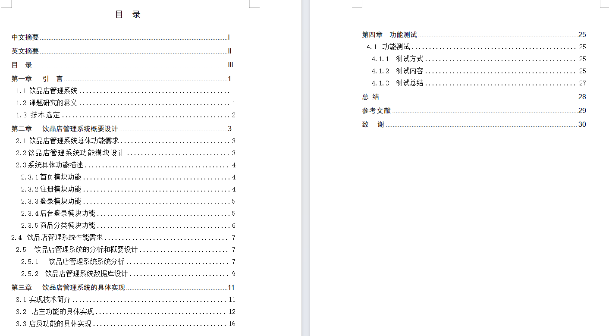
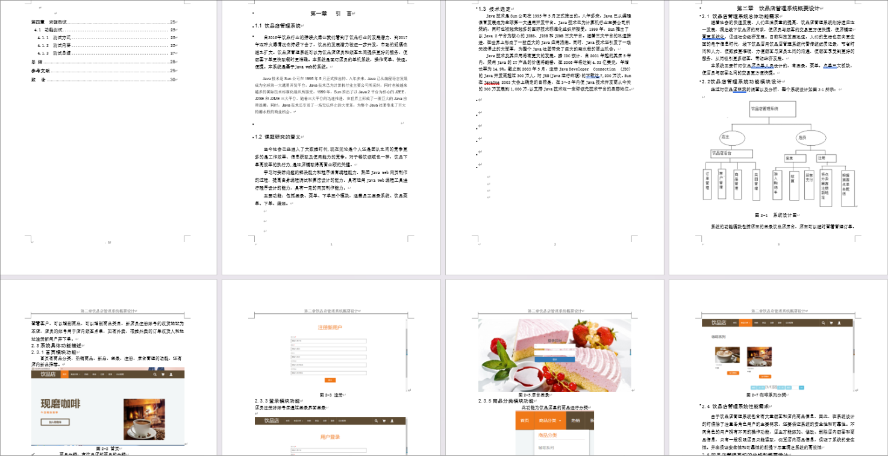
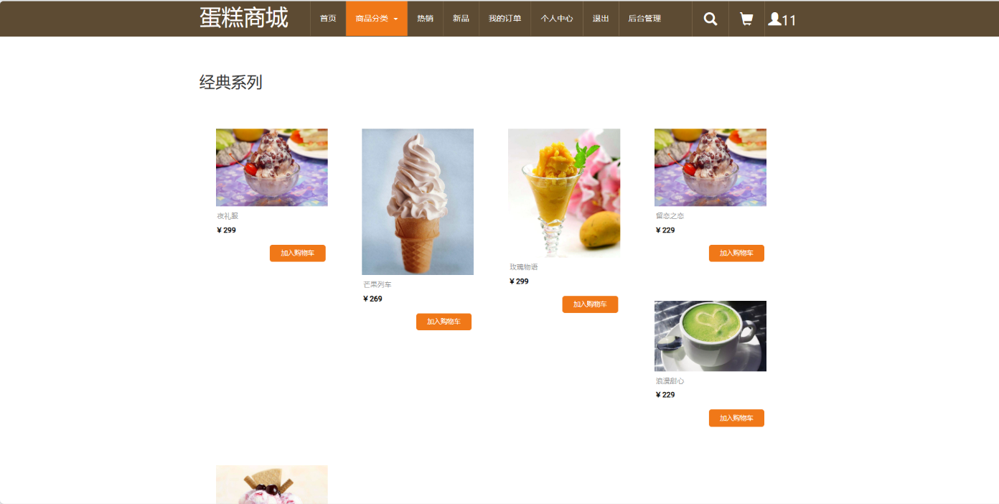
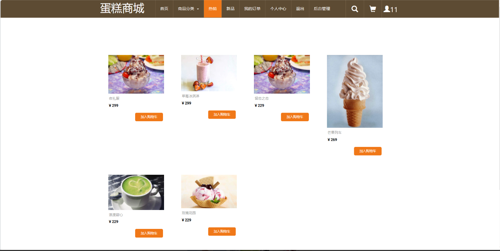
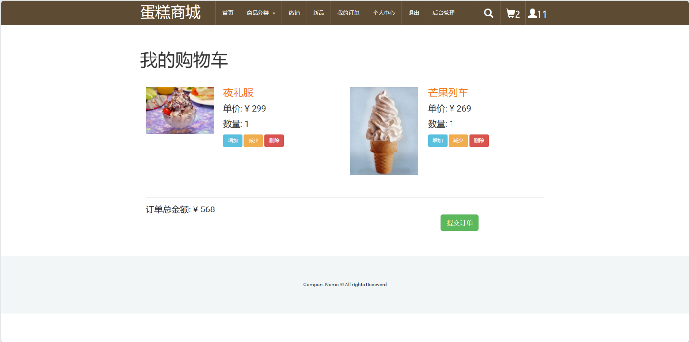
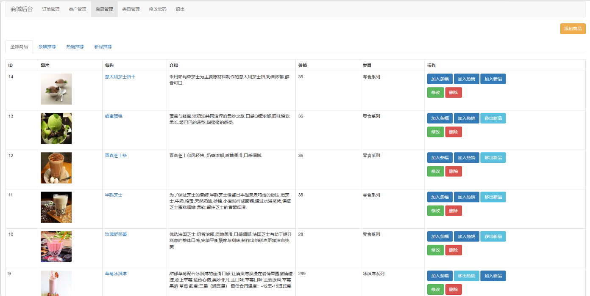
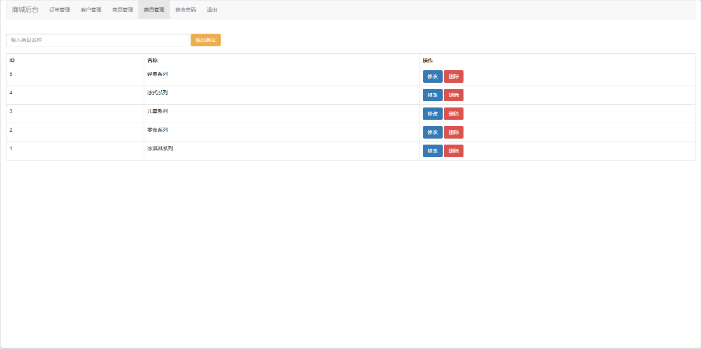

# CakeMall
网上蛋糕商城管理系统_管理系统_毕业设计源码带7000字项目文档蛋糕店管理系统

### 完整项目获取

通过网盘分享的文件：蛋糕商城管理系统

链接: https://pan.baidu.com/s/1WAr1drX_JD9nCuyJK2XpRQ?pwd=9zbt 提取码: 9zbt
--来自百度网盘超级会员v3的分享

### 项目合集(项目不断更新中，包含java、vue、python、Android、微信小程序等项目)

链接: https://pan.baidu.com/s/1nY-zhvAK0CXYcn3g7LzQnQ?pwd=id3c 提取码: id3c
--来自百度网盘超级会员v3的分享

### 工具包

链接: https://pan.baidu.com/s/1YmdoJvkjoUjA75wvHLDZ6A?pwd=xm96 提取码: xm96
--来自百度网盘超级会员v3的分享

需要远程项目部署或项目修改和毕业设计也可联系（添加申请时请备注好来意）

### 远程调试部署联系方式

链接: https://pan.baidu.com/s/1W0dDcoZmayG0c7USJDYBYg?pwd=nqd7 提取码: nqd7
--来自百度网盘超级会员v3的分享

#### 这些项目一起发你了 可以分享给你需要的同学 调试可找我 也接二次修改和项目定制、毕业设计等

## 接毕业设计和论文

微信联系方式：xzxj0206  QQ：3808981644   (支持修改、 部署调试、 支持代做毕设)

接网站建设、小程序、H5、APP、各种系统等，单片机、嵌入式也可以做

选题+开题报告+任务书+程序定制+安装调试+论文+答辩ppt  都可以做

## 一、介绍

语言: Java 数据库：MySQL  

技术栈： Java+JSP + Spring+Spring MVC+Mybatis

系统角色 : 管理员、用户

一，管理员

管理员有订单管理，用户管理，商品管理，分类管理等功能

二，用户

用户可进行注册，登录，查看商品列表，查看商品详情，加入购物车，购买商品等功能

## 二、系统运行界面

